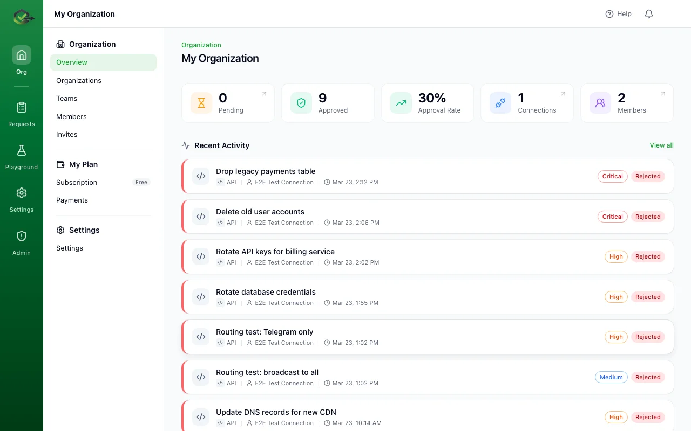
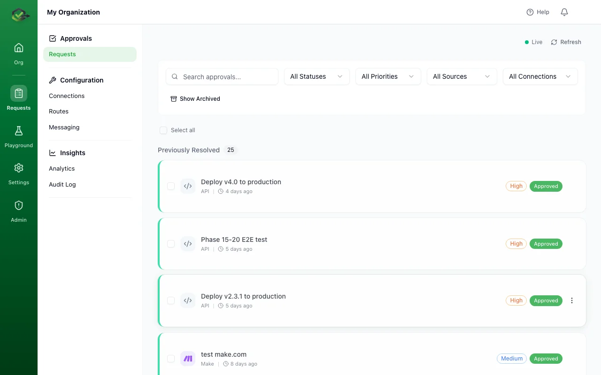
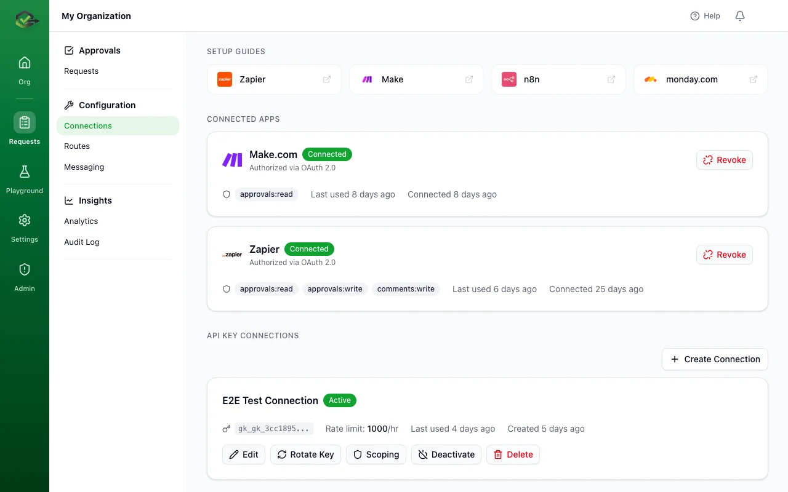
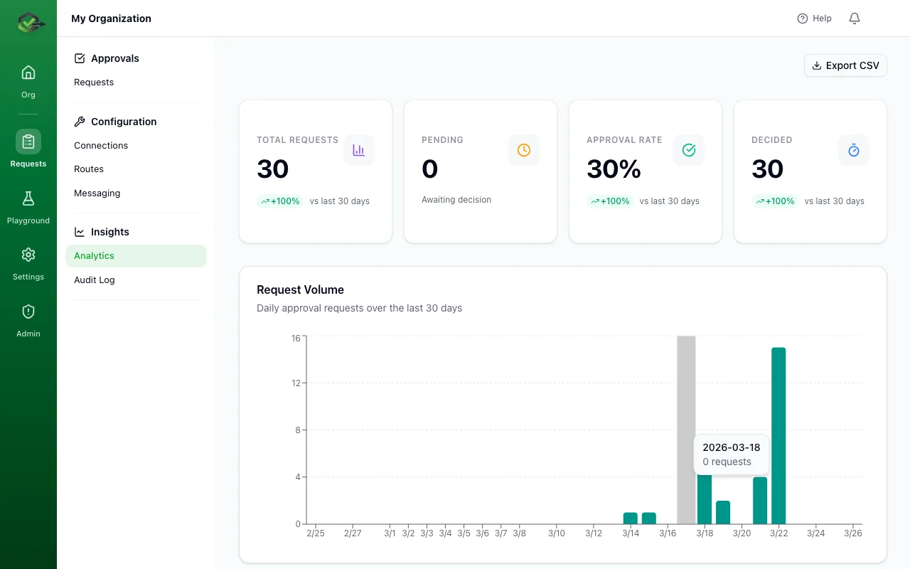
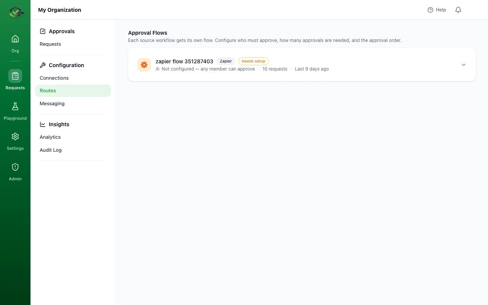

<p align="center">
  <a href="https://okrunit.com">
    <picture>
      <source media="(prefers-color-scheme: dark)" srcset="public/logo_text_white.png" />
      <source media="(prefers-color-scheme: light)" srcset="public/logo_text.png" />
      
    </picture>
  </a>
</p>

<p align="center">
  <strong>Human-in-the-loop approval gateway for AI agents & automations</strong>
</p>

<p align="center">
  Add human approval to any automation workflow.<br />
  One API call. Approve from Slack, email, or dashboard.
</p>

<p align="center">
  <a href="https://okrunit.com">Website</a> &middot;
  <a href="https://okrunit.com/docs">Documentation</a> &middot;
  <a href="https://okrunit.com/docs/api-reference">API Reference</a> &middot;
  <a href="https://okrunit.com/changelog">Changelog</a>
</p>

---

<p align="center">
  
</p>

## The Problem

AI agents and automated workflows are powerful — but sometimes they need a human to say **"yes"** before taking action. Deleting production data, sending bulk emails, deploying to production, or modifying customer accounts are all actions that should require human oversight.

## The Solution

**OKRunit** pauses your automation, notifies the right people, collects their decision, and delivers it back — all through a single API call.

```bash
curl -X POST https://okrunit.com/api/v1/approvals \
  -H "Authorization: Bearer YOUR_API_KEY" \
  -H "Content-Type: application/json" \
  -d '{
    "title": "Deploy v4.0 to production",
    "priority": "high",
    "callback_url": "https://your-app.com/webhook"
  }'
```

Your workflow pauses. Reviewers get notified. Once approved (or rejected), the decision is delivered to your callback URL instantly.

---

## Features

<table>
<tr>
<td width="50%">

### Approval Dashboard

Review every request in real time. Filter by status, priority, source, or connection. Approve or reject with one click.

</td>
<td width="50%">



</td>
</tr>
<tr>
<td width="50%">



</td>
<td width="50%">

### Connections & Integrations

Connect your automation platforms with OAuth or API keys. Setup guides walk you through Zapier, Make, n8n, and more in minutes.

</td>
</tr>
<tr>
<td width="50%">

### Analytics & Audit Trail

Full visibility into approval rates, response times, and request volumes. Every request, vote, and decision is logged for compliance.

</td>
<td width="50%">



</td>
</tr>
<tr>
<td width="50%">



</td>
<td width="50%">

### Smart Routing & Rules Engine

Route approvals to the right people automatically. Define rules based on action type, priority, source, or custom conditions.

</td>
</tr>
</table>

---

## How It Works

```
┌─────────────┐     ┌──────────┐     ┌───────────────┐     ┌─────────────┐
│  Your Agent  │────▶│  OKRunit │────▶│   Reviewers   │────▶│  Decision   │
│  or Workflow │     │   API    │     │ (Slack/Email/  │     │  delivered  │
│              │◀────│          │◀────│  Dashboard)    │◀────│  via webhook│
└─────────────┘     └──────────┘     └───────────────┘     └─────────────┘
```

1. **Your automation sends a request** — One API call with the action details
2. **Reviewers get notified** — Via Slack, email, push notifications, or the dashboard
3. **A human decides** — Approve or reject with context and comments
4. **Decision delivered instantly** — Webhook callback fires with the result

---

## Integrations

OKRunit connects with the tools you already use.

### Automation Platforms

<table>
<tr>
<td align="center" width="11%"><br /><sub>Zapier</sub></td>
<td align="center" width="11%"><br /><sub>Make</sub></td>
<td align="center" width="11%"><br /><sub>n8n</sub></td>
<td align="center" width="11%"><br /><sub>GitHub Actions</sub></td>
<td align="center" width="11%"><br /><sub>Windmill</sub></td>
<td align="center" width="11%"><br /><sub>Temporal</sub></td>
<td align="center" width="11%"><br /><sub>Dagster</sub></td>
<td align="center" width="11%"><br /><sub>Pipedream</sub></td>
<td align="center" width="11%"><br /><sub>Prefect</sub></td>
</tr>
</table>

### Messaging & Notifications

<table>
<tr>
<td align="center" width="14%"><br /><sub>Slack</sub></td>
<td align="center" width="14%"><br /><sub>Discord</sub></td>
<td align="center" width="14%"><br /><sub>Teams</sub></td>
<td align="center" width="14%"><br /><sub>Telegram</sub></td>
<td align="center" width="14%"><br /><sub>Email</sub></td>
</tr>
</table>

---

## Use Cases

- **AI Agents** — Pause before destructive actions like deleting data or modifying accounts
- **Production Deployments** — Gate releases behind team approval
- **Bulk Operations** — Require sign-off on mass email sends or data migrations
- **Financial Actions** — Approve high-value transactions or billing changes
- **Infrastructure Changes** — Review DNS updates, credential rotations, or config changes
- **Compliance Workflows** — Enforce approval policies for regulated operations

---

## Quick Start

### 1. Create an account

Sign up at [okrunit.com](https://okrunit.com) and create your organization.

### 2. Get your API key

Go to **Connections** in the dashboard and create an API key.

### 3. Send your first approval request

```bash
curl -X POST https://okrunit.com/api/v1/approvals \
  -H "Authorization: Bearer YOUR_API_KEY" \
  -H "Content-Type: application/json" \
  -d '{
    "title": "Delete inactive user accounts",
    "description": "Remove 847 accounts inactive for 90+ days",
    "priority": "critical",
    "callback_url": "https://your-app.com/webhook/approval-result"
  }'
```

### 4. Handle the decision

OKRunit delivers the result to your callback URL:

```json
{
  "approval_id": "apr_abc123",
  "status": "approved",
  "decided_by": "jane@yourcompany.com",
  "decided_at": "2026-04-06T14:32:00Z",
  "comment": "Verified the list looks correct. Approved."
}
```

---

## SDKs

| Language | Package |
|----------|---------|
| TypeScript / Node.js | [`@okrunit/sdk`](https://okrunit.com/docs/sdks) |
| Go | [`okrunit-go`](https://okrunit.com/docs/sdks) |
| CLI | [`@okrunit/cli`](https://okrunit.com/docs/sdks) |

```typescript
import { OKRunit } from "@okrunit/sdk";

const client = new OKRunit({ apiKey: "YOUR_API_KEY" });

const approval = await client.approvals.create({
  title: "Deploy v4.0 to production",
  priority: "high",
  callbackUrl: "https://your-app.com/webhook",
});

// approval.status === "pending"
```

---

## Pricing

| | Free | Pro | Business | Enterprise |
|---|---|---|---|---|
| **Price** | $0/mo | $20/mo | $60/mo | Custom |
| **Requests** | 100/mo | Unlimited | Unlimited | Unlimited |
| **Connections** | 2 | 15 | Unlimited | Unlimited |
| **Team members** | 3 | 15 | Unlimited | Unlimited |
| **History** | 7 days | 90 days | 1 year | Unlimited |
| **Notifications** | Email | + Slack, Webhooks | + All channels | + All channels |
| **Rules engine** | — | Yes | Yes | Yes |
| **Analytics** | — | Yes | Yes | Yes |
| **SSO / SAML** | — | — | Yes | Yes |
| **Audit log export** | — | — | Yes | Yes |
| **Dedicated support** | — | — | — | Yes |

---

## Tech Stack

- **Framework** — [Next.js](https://nextjs.org) (App Router)
- **Database** — [Supabase](https://supabase.com) (PostgreSQL)
- **Auth** — Supabase Auth + WebAuthn passkeys + SAML SSO
- **UI** — [shadcn/ui](https://ui.shadcn.com) + [Tailwind CSS](https://tailwindcss.com)
- **Payments** — [Stripe](https://stripe.com)
- **Email** — [Resend](https://resend.com)
- **Hosting** — [Vercel](https://vercel.com)

---

## Development

```bash
# Install dependencies
pnpm install

# Start the development server
pnpm dev
```

Open [http://localhost:3000](http://localhost:3000) to see the app.

---

## License

Copyright &copy; 2026 OKRunit. All rights reserved.

<p align="center">
  <a href="https://okrunit.com">
    
  </a>
</p>

<p align="center">
  <sub>Built with care for teams who need humans in the loop.</sub>
</p>
